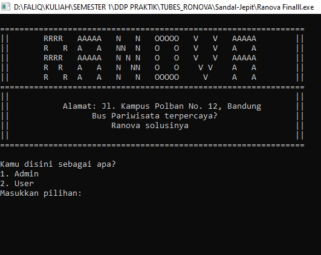
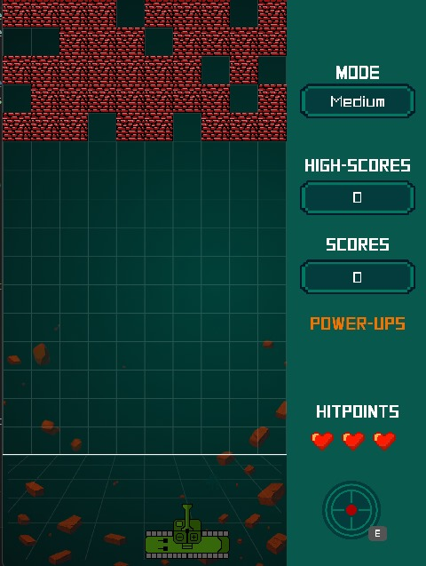
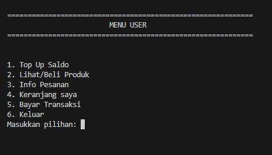

# 🌐 Personal Portfolio Website

## 📝 A. Penjelasan Singkat Tentang Proyek
Proyek ini adalah **personal portfolio website** milik **Muhammad Faliq Shiddiq Azzaki**.  
Website ini berisi informasi tentang diri saya, skill yang saya miliki, riwayat pendidikan, daftar project, dan kontak yang bisa dihubungi.  
Tujuan utama dari website ini adalah untuk memperkenalkan diri secara profesional dan memberikan akses mudah ke informasi penting, baik untuk keperluan akademik maupun profesional.

Fitur utama:
- **Landing Page** — Perkenalan singkat dan tombol navigasi cepat.
- **Skills Section** — Menampilkan kemampuan dalam **Programming**, **Discussion**, dan **Collaboration**.
- **Education Section** — Riwayat pendidikan dari SD hingga Politeknik Negeri Bandung.
- **Project Section** — Showcase beberapa project yang sudah pernah dikerjakan.
- **Contact Section** — Berisi informasi untuk menghubungi saya.

---

## 🛠️ B. Teknologi yang Digunakan
Website ini dibangun dengan menggunakan teknologi berikut:

| Teknologi      | Deskripsi |
|---------------|-------------------------------------------|
| **HTML5**     | Membuat struktur dan konten website |
| **CSS3**      | Mendesain tampilan website secara manual |
| **Google Fonts** | Menggunakan font [Nunito](https://fonts.google.com/specimen/Nunito) & [Quicksand](https://fonts.google.com/specimen/Quicksand) |
| **Responsive Design** | Mendukung tampilan untuk desktop, tablet, dan smartphone |
| **SVG Icons** | Menggunakan icon vektor agar tampilan lebih modern |

---

## 🧩 C. Bukti Modifikasi Framework
Website ini **tidak menggunakan framework** seperti **Bootstrap**, **TailwindCSS**, atau framework lain.  
Seluruh tampilan, tata letak, dan elemen website dibuat **secara manual** menggunakan **HTML + CSS** untuk memastikan desain tetap **custom dan fleksibel**.

---

## 💻 D. Project yang Ditampilkan
Beberapa project yang ditampilkan di dalam website:

| Project         | Preview | Repository |
|---------------|---------|------------|
| **RONOVA** |  | [Lihat Project](https://github.com/Faliqazzaki/Sandal-Jepit.git) |
| **Block Shooter** |  | [Lihat Project](https://github.com/riefproject/21IF009-Project2-A5.git) |
| **AlpenlieShop** |  | [Lihat Project](https://github.com/Nurvyy217/Tubes_SDA_OnlineShop-C.git) |

---

## 🌍 E. Link Deploy Website
Jika website ini sudah dideploy, kamu bisa mengaksesnya melalui link berikut:

🔗 **[https://faliqazzaki.github.io/personal-portfolio](https://faliqazzaki.github.io/personal-portfolio)**

> Jika belum dideploy, saya sarankan menggunakan **GitHub Pages** agar mudah diakses dan dibagikan.

---

## 📬 Kontak
Jika ingin berdiskusi, berkolaborasi, atau sekadar menyapa, silakan hubungi saya melalui:

- **Email**: [faliqazzaki@gmail.com](mailto:faliqazzaki@gmail.com)  
- **GitHub**: [github.com/Faliqazzaki](https://github.com/Faliqazzaki)  
- **Instagram**: [@faliqazzakifaliqazzaki](https://www.instagram.com/faliqazzakifaliqazzaki/)

---

💡 *Made with ❤️ and code by **Muhammad Faliq Shiddiq Azzaki***
